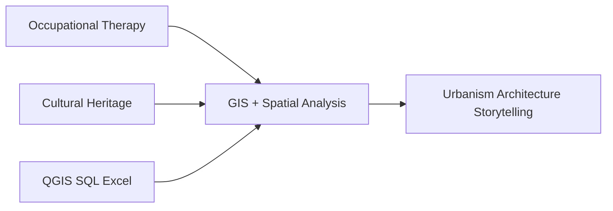

<div align="center">

# 👋 Hi, I'm Cheyanne Richardson


**| GIS | Spatial Analysis | Cultural Heritage | Human-Centered Design**

</div>

## 🌍 About Me

**GIS professional** blending **cultural resource management** + **occupational therapy** → **spatial data science**

I map how **everyday spaces reveal culture, memory, and design** – preserving stories in changing urban landscapes.



## 🛠️ Current Toolkit

| Learning | Status | Projects |
|----------|--------|----------|
| 🔍 **QGIS** | 🟡 Building | Map design, spatial analysis |
| 💾 **SQL** | 🟢 Active | Database workflows, data cleaning |
| 📊 **Excel** | 🟢 Strong | Data workflows, analysis |

## 💼 Professional Foundation

```
Occupational Therapy (Healthcare)
├── Medicare-compliant documentation
├── Workflow optimization
└── Regulated data standards

Cultural Resource Management
├── Gault School of Archaeology
├── Texas Historical Commission
├── Artifact cataloging
└── Data validation + integrity
```

## 🎯 What I'm Building

- **GIS** → Historical data + modern mapping = **place evolution**
- **SQL** → Clean, reliable geospatial databases
- **Spatial Design** → Accessibility + human-centered mapping

## 🔮 Long-term Vision

**Study hanok architecture** @ Jeonbuk National University  
**Blend** traditional design + sustainable urban planning

```
modern spaces
+ historical layers  
+ human-centered design
= spatial storytelling
```

## 🌐 Let's Connect

[](https://yourwebsite.com)
[](https://linkedin.com/in/yourprofile)
[](mailto:you@email.com)

**Open to projects:** GIS | Data Visualization | Architectural Preservation | Digital Heritage Mapping | Human-Centered Design

---

<div align="center">
<i>Made with ❤️ for spatial storytelling</i>
</div>
