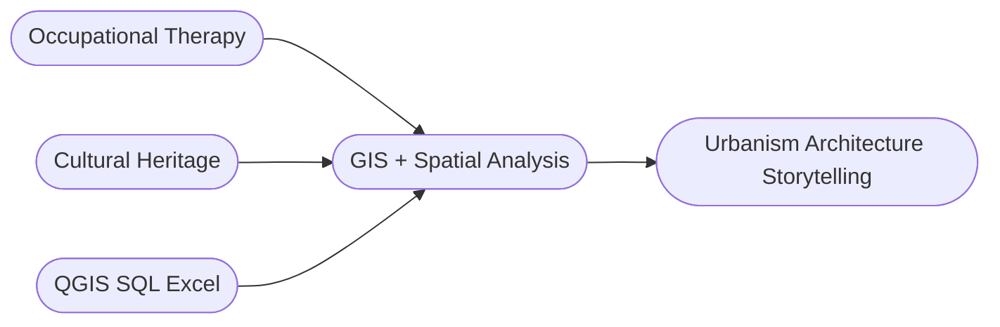

<div align="center">

# Hi, I'm Cheyanne

**Geospatial Modeling  -  Spatial Analysis  -  Cultural Heritage  -  Human-Centered Design**


## About Me

I’m a GIS analysit with a background in cultural resource management and occupational therapy, now focusing on spatial data analysis and geospatial technologies. I’m interested in how everyday spaces—both modern and historical—reveal layers of culture, memory, and design, and how geospatial tools can help preserve their stories within a changing urban landscape.



## 🛠️ Current Toolkit

| Learning | Status | Projects |
|----------|--------|----------|
| 🔍 **QGIS** | 🟡 Building | Map design, spatial analysis, and data visiulziaition |
| 💾 **SQL** | 🟢 Active | Database querying and management |
| 📊 **Excel** | 🟢 Strong | Data cleaning and analytical workflows |

## Professional Foundation

<div align="left">
With a foundation in both healthcare and cultural heritage work, I bring precision, analytical rigor, and accountatbility to complex data enviroments:

```
Occupational Therapy
├── Create accurate, compliance-ready technical documentation
├── Workflow optimization
└── Regulated data standards

Cultural Resource Management
├── Gault School of Archaeology
├── Texas Historical Commission
├── Artifact cataloging
└── Data validation + integrity
```
These expereinces have strengthened my ability to:

```
├── Organize and validate structured datasets
├── Uphold data integrity and consistenty
├── Communicate technical findings to diverse stakeholders
└── Navigate both modern and legacy information systems
```
</div>

## 🎯 What I'm Building
<div align="left">

I’m building a career that combines the analytical precision and data‑driven organization from my professional background with a growing focus on urbanism, architectural heritage, and spatial storytelling. I’m fascinated by how modern and historical spaces coexist and what they reveal about community and identity.

- **GIS** → Historical data + modern mapping = **place evolution**
- **SQL** → Clean, reliable geospatial databases
- **Spatial Design** → Accessibility + human-centered mapping

</div>

## 🔮 Long-term Vision

**Study hanok architecture** @ Jeonbuk National University  
**Blend** traditional design + sustainable urban planning

```
modern spaces + historical layers + human-centered design = spatial storytelling
```

## 🌐 Let's Connect

[](https://yourwebsite.com)
[](https://linkedin.com/in/yourprofile)
[](mailto:you@email.com)

**Open to projects:** GIS | Data Visualization | Architectural Preservation | Digital Heritage Mapping | Human-Centered Design

---

<div align="center">
<i>Made with ❤️ for spatial storytelling</i>
</div>
</div>
