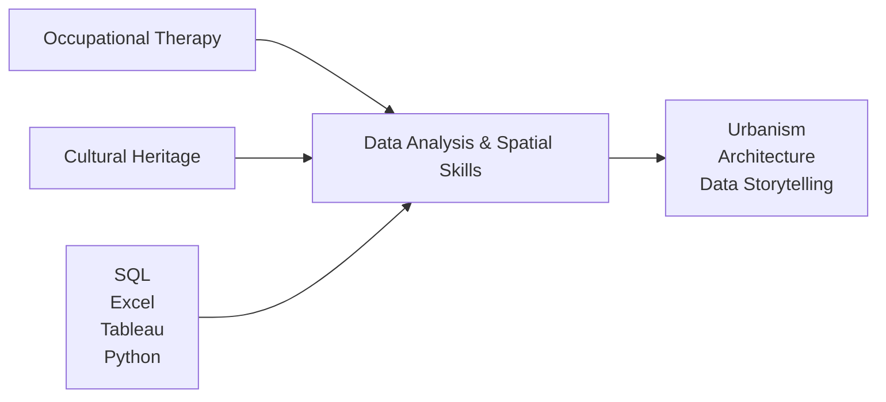

<div align="center">

# Hi, I'm Cheyanne 

**Data Analysis - Spatial Visualization - Cultural Heritage - Human-Centered Design**

## About Me

I’m a data analysit with a background in cultural resource management and occupational therapy, now focusing on spatial data analysis and visualization. I’m passionate about using data analysis to revel how everyday spaces—both modern and historical—reveal patterns of culture, memory, and design, and how spatial analytics tools can preserve those insights amid urban change.



## 🛠️ Current Toolkit

| Toolkit | Learning | Status | Projects |
|---------|----------|--------|----------|
| 💾 **SQL** | 🟢 Active | Database querying and management | |
| 📊 **Excel** | 🟢 Strong | Data cleaning and analytical workflows | |
| 📈 **Tableau** | 🟡 Building | Interactive dashboards and storytelling | |
| 🐍 **Python** | 🟡 Building | Data analysis, automation, and scripting | |

## Professional Foundation

<div align="left">
With a foundation in both healthcare and cultural heritage work, I bring precision, analytical rigor, and accountatbility to complex data enviroments:

```
Occupational Therapy
├── Create accurate, compliance-ready technical documentation
├── Workflow optimization
└── Regulated data standards

Cultural Resource Management
├── Gault School of Archaeology
├── Texas Historical Commission
├── Artifact cataloging
└── Data validation + integrity
```
These expereinces have strengthened my ability to:

```
├── Organize and validate structured datasets
├── Uphold data integrity and consistenty
├── Communicate technical findings to diverse stakeholders
└── Navigate both modern and legacy information systems
```
</div>

## 🎯 What I'm Building
<div align="left">

I’m building a career that combines the analytical precision and data‑driven organization from my professional background with a growing focus on urbanism, architectural heritage, and spatial storytelling. I’m fascinated by how modern and historical spaces coexist and what they reveal about community and identity.

- **SQL** → Clean, reliable data sources  
- **Excel** → Historical data + modern analysis = **place evolution**  
- **Tableau** → Accessibility + human-centered visualization  
- **Python** → Automation + scalable data workflows  
- **Spatial Design** → Accessibility + human-centered mapping

</div>

## 🔮 Long-term Vision

> *modern spaces + historical layers + human-centered design = spatial storytelling*

<div align='left'>

**🎯 Future Goal:** Study **hanok architecture** at Jeonbuk National University

**🌟 Mission:** Blend traditional design principles with sustainable, people-centered urban planning

</div>


## 🌐 Let's Connect

[](https://linkedin.com/in/cheyanne-richardson)
[](mailto:cheyanne.richardson@proton.me)

**Open to projects:** GIS | Data Visualization | Architectural Preservation | Digital Heritage Mapping | Human-Centered Design

---
</div>
