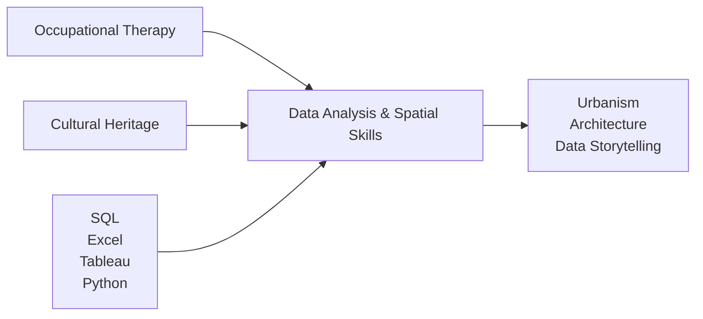

<div align="center">

# Hi, I'm Cheyanne 

**Data Analysis - Spatial Visualization - Human-Centered Design - Climate‑Resilient Planning**

## About Me

I’m a data analysit with a background in cultural resource management and occupational therapy, now focusing on spatial data analysis and visualization. 
I approach data as both a technical and narrative tool. 
Through spatial analysis and visualization, I translate complex patterns into accessible insights that inform the evolution of public spaces and urban systems.


```mermaid
graph LR
   A[Occupational Therapy] --> B[Data Analysis & Spatial Skills]
    C[Cultural Heritage] --> B
    D[SQL<br/>Excel<br/>Tableau<br/>Python] --> B
    B --> E[Urbanism<br/>Architecture<br/>Data Storytelling]
```

## 🛠️ Current Toolkit

| Toolkit | Learning | Status | Projects |
|---------|----------|--------|----------|
| 💾 **SQL** | 🟢 Active | Database querying and management | |
| 📊 **Excel** | 🟢 Strong | Data cleaning and analytical workflows | |
| 📈 **Tableau** | 🟡 Building | Interactive dashboards and storytelling | |
| 🐍 **Python** | 🟡 Building | Data analysis, automation, and scripting | |

## Professional Foundation

<div align="left">
With a foundation in both healthcare and cultural heritage work, I bring precision, analytical rigor, and accountatbility to complex data enviroments:

```
Occupational Therapy
├── Create accurate, compliance-ready technical documentation
├── Workflow optimization
└── Regulated data standards

Cultural Resource Management
├── Gault School of Archaeology
├── Texas Historical Commission
├── Artifact cataloging
└── Data validation + integrity
```
These expereinces have strengthened my ability to:

```
├── Organize and validate structured datasets
├── Uphold data integrity and consistenty
├── Communicate technical findings to diverse stakeholders
└── Navigate both modern and legacy information systems
```
</div>

## 🎯 What I'm Building
<div align="left">

I’m building a career that blends analytical precision and data‑driven organization with an expanding focus on urban systems, spatial storytelling, and climate‑resilient design.
My work explores how culture, environment, and community shape one another across time and place.

- **SQL** → Clean, reliable data sources  
- **Excel** → Historical data + modern analysis = **place evolution**  
- **Tableau** → Accessibility + human-centered visualization  
- **Python** → Automation + scalable data workflows  
- **Spatial Design** → Accessibility + human-centered mapping

</div>

## 🔮 Long-term Vision

> *modern spaces + historical layers + human-centered design = spatial storytelling*

<div align='left'>

**🎯 Future Goal:** Bridge data analysis with sustainable, tradition-informed urban design—studying hanok architecture to connect analytics with culturally grounded planning.

**🌟 Mission:** Blend traditional design principles with sustainable, people-centered urban planning

</div>

## 🌐 Let's Connect

[](https://linkedin.com/in/cheyanne-richardson)
[](mailto:cheyanne.richardson@proton.me)

**Open to projects:** I’m interested in projects at the intersection of data visualization, human-centered design, and environmental data, with a focus on public space design and climate-resilient infrastructure planning.

---
</div>
